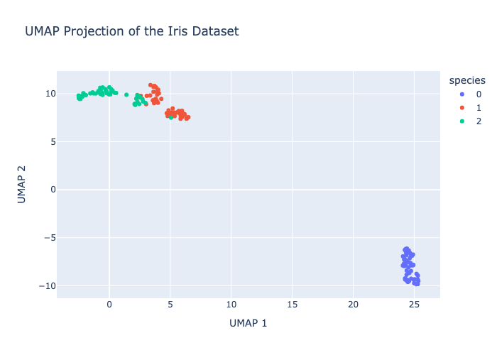

# Visualize.py

`visualize.py` performs dimensionality reduction on the Iris dataset using UMAP (Uniform Manifold Approximation and Projection) and creates an interactive 2D scatter plot with Plotly. The scatter plot highlights the different species within the Iris dataset, with the projections plotted in a two dimensionsional graph.

## Code Explanation

The script follows these steps:

1. **Load the Iris dataset**: It uses the built-in Iris dataset from `sklearn.datasets`.
2. **Apply UMAP**: The `UMAP` algorithm is used to reduce the dimensionality of the dataset.
3. **Create a scatter plot**: Using Plotly Express, it generates an interactive scatter plot where each point represents an observation from the Iris dataset, color coded by species.
4. **Export the plot**: The plot is saved as an HTML file (`index.html`) in the `public` directory, making it easy to open in a browser for interactive exploration.

## Requirements

Before running the script, make sure that you have the required dependencies installed in your conda environment. This project specifically requires the `dsan-6700` environment to be activated.

### Activating the Conda Environment

To activate the `dsan-6700` environment, run the following command in your terminal:

```bash
conda activate dsan-6700
```

## Usage

Once the environment is activated, run the script as follows:

```bash
python visualize.py
```

This will generate an interactive scatter plot for the Iris dataset and save the result in `public/index.html`.

## Visualization

A static screenshot of the plot is attached here to get an understanding of the results:


